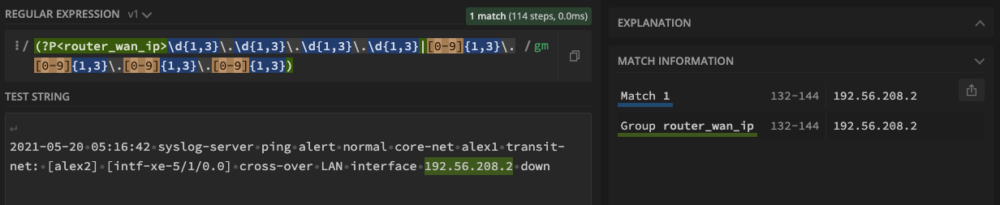

# Regex for IP addresses
This readme file explains how to use regular expressions to detect an IP address in a log file.

## Summary
The following regular expression is for detecting IP addresses in a text file (generally in router logs forwared to a syslog server).

```
/(?P<router_wan_ip>^\d{1,3}\.\d{1,3}\.\d{1,3}\.\d{1,3}|[0-9]{1,3}\.[0-9]{1,3}\.[0-9]{1,3}\.[0-9]{1,3}$)/gm
```

a sample log -
```
2021-05-20 05:16:42 syslog-server ping alert normal core-net alex1 transit-net: [alex2] [intf-xe-5/1/0.0] cross-over LAN interface 192.56.208.2 down
```

Result -


**Disclaimer** - in the above regex, \d{1,3} or [0-9]{1,3} will match any numbers between 0 and 999. So, the above regex will also match 987.654.321.0 as an IP address which is incorrect as each octet in IP addresses can only be within 0 - 255 range. 

The idea is that this regex is for pattern matching and not for validation. The anticipation is that syslog messages will already have valid IPs in them, as Operating Systems on devices such as routers, switches or end hosts, which produces these syslog messages, will prohibit configuring any invalid IP on any of their interfaces.
## Table of Contents

- [Anchors](#anchors)
- [Quantifiers](#quantifiers)
- [Grouping Constructs](#grouping-constructs)
- [Bracket Expressions](#bracket-expressions)
- [Character Classes](#character-classes)
- [The OR Operator](#the-or-operator)
- [Flags](#flags)
- [Character Escapes](#character-escapes)

## Regex Components

### Anchors
Generally regex is used to match a pattern. Anchors are different in the sense that they do not match any character, rather they match a position like before, after or between characters. Here are some of the commonly used anchors -

|Description | Symbol |
|-------------|--------|
|Start of string| ^|
|End of String| $ |
|Word Boundary| \b |


### Quantifiers
Quantifiers allow you to specify the number of occurrences to match against. Below is a list of quantifiers -

|Description | Symbol |
|-------------|--------|
|Zero or one of a| a?|
|Zero or more of a| a* |
|One or more of a| a+ |
|Exactly `n` of a| a{n} |
|`n` or more of a| a{n,} |
|Between `m` and `n` of a| a{m,n} |
|Greedy quantifier| a* |
|Lazy quantifier| a*? |
|Possesive quantifier| a*+ |

In our regex above we used \d{1,3} or [0-9]{1,3} - which indicates that any octet in IP address are numbers but between 1 and 3 characters long.
### Grouping Constructs
Grouping constructs are used to capture substrings of an input string. This is done using preanthesis (). Some of the grouping constructs are -

|Regular Expression	|Description|
|-------------|--------|
|(expr)	|Match or capture group. Captures the information that matches the expression in parentheses.|
|(?:expr)	|Non-capturing group. Groups the contained expressions together (e.g., to apply a quantifier to multiple symbols at once), but does not restrict the information to be captured to only that group.|
|(?=expr)	|Captures information that is followed by the expression if the expression is true and the input matches the pattern that follows this expression.|
|(?<>)	|Named capture group.*|

In our example above, we used `(?P<router_wan_ip>...)` which indicates that the captured IP address will be assigned to a variable named `router_wan_ip` as shown in the example image above.
### Bracket Expressions
Bracket Expressions (an expression enclosed in square brackets, `[]`) are used to match a character out of a set of characters and the hyphen signifies the range of characters to match from.

In example above, [0-9] indicates all decimal digits from the range of 0-9. Likewise, for hex numbers we can use [a-f0-9] which indicates the range of hex digits 0-9,a,b,c,d,e,f.

Square brackets allow only characters or character classes.

### Character Classes
A character class is a special notation that matches any symbol from a certain set. For example, `digit` class is written as `\d` and corresponds to *any single digit*. Common character classes -

|Character Class|Description|
|---------------|-----------|
|\d |digits.|
|\D |non-digits.|
|\s |space symbols, tabs, newlines.|
|\S |all but \s.|
|\w |Latin letters, digits, underscore '_'.|
|\W |all but \w.|
|[abc]| a single character of a, b or c.|
|[^abc]| a character except a, b or c.|
|[a-zA-Z]| a character in range a-z or A-Z.|
|[^a-zA-Z]| a character not in range a-z or A-Z.|

### The OR Operator
The OR (`|`) operator is used to match a single regular expression out of several possible regular expressions. This is similar to the logical operator OR, which matches one or more sub-expressions from a set of expressions separated by `|` operator.

For instance, if we need to find programming languages: HTML, PHP, Java,JavaScript or Script, the corresponding regex is: `HTML|PHP|Java(Script)?`.

### Flags
Flags in regular expressions influences searching behaviour of given patterns. Below are some of the regex flags -

|Flag	|Name	|Modification|
|-----|-----|------------|
|i	 |Ignore Case	|Makes the expression search case-insensitively.|
|g	|Global	|Makes the expression search for all occurences.|
|m	|Multiline	|Makes the boundary characters ^ and $ match the beginning and ending of every single line instead of the beginning and ending of the whole string.|
|u	|Unicode	|Makes the expression assume individual characters as code points, not code units, and thus match 32-bit characters as well.|

For example, in the previous example in `OR` we gould use `/i` flag to ignore case while matching patterns - `/html|php|Java(script)?/i`.

Very commonly used flags are for multiline log searches are `g`, `i` and `m`, that is `/igm`.
### Character Escapes

## Author

A short section about the author with a link to the author's GitHub profile (replace with your information and a link to your profile)
